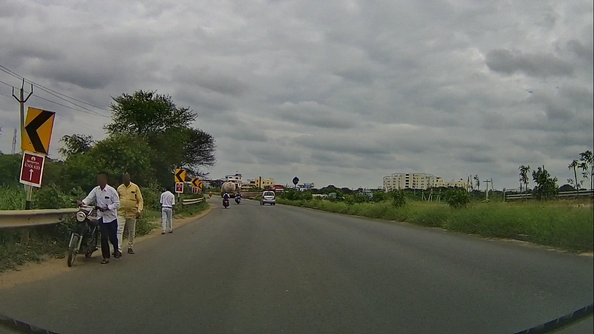
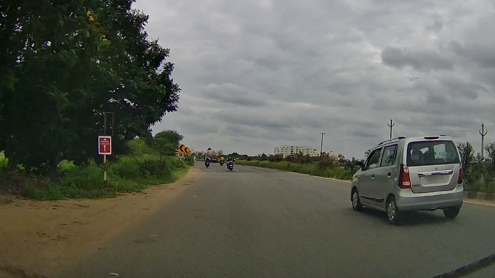

<h1> Dashcam Anonymizer </h1>






This repository blurs human faces and license plates in images and videos, using a state-of-the-art object detection model, [YOLOv8 by Ultralytics](https://github.com/ultralytics/ultralytics) and is fine-tuned using images from the [OpenImagesDatasetV7](https://storage.googleapis.com/openimages/web/index.html).

git clone this repo by
```
https://github.com/varungupta31/dashcam_anonymizer.git
```

Install the conda environment

```
#If on Linux
conda env create -f environment.yml
conda activate dashanon
#If on MacOS
conda env create -f envmacos.yml
conda activate dashanonmac
```

<h3> Blurring Images in a Directory </h3>

To blur all images in a directory,

Download the model from [here](https://iiitaphyd-my.sharepoint.com/:u:/g/personal/gupta_varun_research_iiit_ac_in/ESmbAC2vtABIvbg-524i-0gBJfARU0IuIFpwktIsXlBbtA?e=fUCBzY) and move it to  `model` dir.

Update the `configs/img_blur.yaml` as required, and run the following command

```
python blur_images.py --config configs/img_blur.yaml
```
The resulting blur images will be stored in the directory specified in the YAML.
Note: `annot_txt` folder will contain the YOLO detections in `.txt` format, converted to the `VOC` bounding-box format.


<h3> Blurring Videos in a Directory </h3>

Similar approach as above, now the command would be

```
python blur_videos.py --config configs/vid_blur.yaml
```
Note:
1. Make sure the opencv is installed via Conda. PIP installation, leaves out some libgc libraries, which causes issues in the videowriter codecs.
2. The configuration files are slightly different for videos and images. Make sure to choose and edit the correct ones depending upon the modality.
3. This is designed to process all the contents in a given directory at once. If the blurring is to be re-run, make sure to delete the `runs` directory, as it may lead to new file names within the runs, which will cause errors.
4. The `blur_videos.py` script currently expects the videos to be named numerically [1.mp4, 111.mp4]
