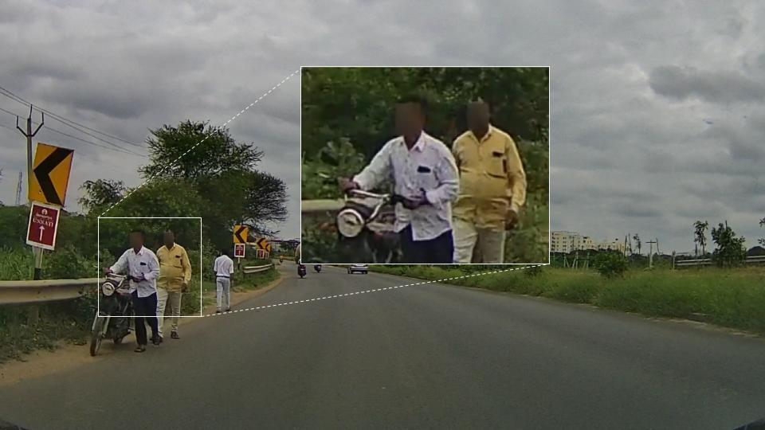

# Dashcam Anonymizer 🕵🏻‍♂️

### This repository blurs human faces and license plates in images and videos using a state-of-the-art object detection model, [YOLOv8 by Ultralytics](https://github.com/ultralytics/ultralytics), and is fine-tuned using images from the [OpenImagesDatasetV7](https://storage.googleapis.com/openimages/web/index.html).

<p align="center">


</p>

# Setup 🔩
Clone this repo by
```
git clone https://github.com/varungupta31/dashcam_anonymizer.git
```

## A Convenient Script Has Been Provided To Setup the Repository 👨🏽‍💻

Activate any Python Environment of Your Preference (`conda` recommended)

Preferably with `Python3.10+` 🐍

```
$ cd dashcam_anonymizer
$ chmod +x setup.sh

# Always be careful runnning .sh files, feel free to browse the contents of setup.sh before running
# The setup.sh file downloads relevant libraries and download the custom YOLO model as well (an alternate link if provided below as well)

$ ./setup.sh
```
[2024 🗞️] The model is now also hosted on a Google Drive, enabling the convenient `gdown` downloads!

<h3> Blurring Images in a Directory  📷</h3>

To blur all images in a directory,

Download the model from [here](https://iiithydresearch-my.sharepoint.com/:u:/g/personal/gupta_varun_research_iiit_ac_in/Ed4j0TaPWu5Os8zl4QDBlgMBF37-pApibw-2NsQu2Ee-sg?e=uYRibp) and move it to  `model` dir.

Update the `configs/img_blur.yaml` as required, and run the following command

```
python blur_images.py --config configs/img_blur.yaml
```
The resulting blur images will be stored in the directory specified in the YAML.
Note: `annot_txt` folder will contain the YOLO detections in `.txt` format, converted to the `VOC` bounding-box format.


[2024 Updated] <h3> Blurring Videos in a Directory 📹</h3>

Similar approach as above, now the command would be

```
python blur_videos.py --config configs/vid_blur.yaml
```
Note:
1. If you run into mysterious `libgc` errors, what worked for me was to also install the `opencv` via `Conda`. PIP installation, leaves out some `libgc` libraries, which causes issues in the videowriter codecs.
2. The configuration files are slightly different for videos and images. Make sure to choose and edit the correct ones depending upon the modality.
3. This is designed to process all the contents in a given directory at once. If the blurring is to be re-run, make sure to delete the `runs` directory, as it may lead to new file names within the runs, which will cause errors.
4. <strike>The `blur_videos.py` script currently expects the videos to be named numerically [1.mp4, 111.mp4]</strike> [Updates 2024, not anymore - name file as you wish]

<hr>

## Please Note 📝
* Will this do a 100% perfect job? --> Maybe not.
  - Some specific angles pose a challenge in perfect detections - especially with faces!
* Is there scope for improvement in terms of optimization? --> There always is.
  - _Good_ to question it and call out, even _better_ to help me improve it :)
* This project has aged somewhat, but I still feel it does a pretty decent job compared to what's out there.
  - If you feel the implementation is outdated, you may still benefit from the model I trained :)
  - If you end up improving the YOLO model, please raise an issue and I'll be glad to incorporate it with due credits.

## If this repository helped you in a research project, please consider to cite and ⭐️ this Repository!


```
@software{dashcam_anonymizer,
  author = {Varun Gupta},
  month = {8},
  title = {{Dashcam Anonymizer}},
  url = {https://github.com/varungupta31/dashcam_anonymizer},
  version = {1.0.0},
  year = {2023}
}
```
and please consider,

[](https://bmc.link/varungupta)

